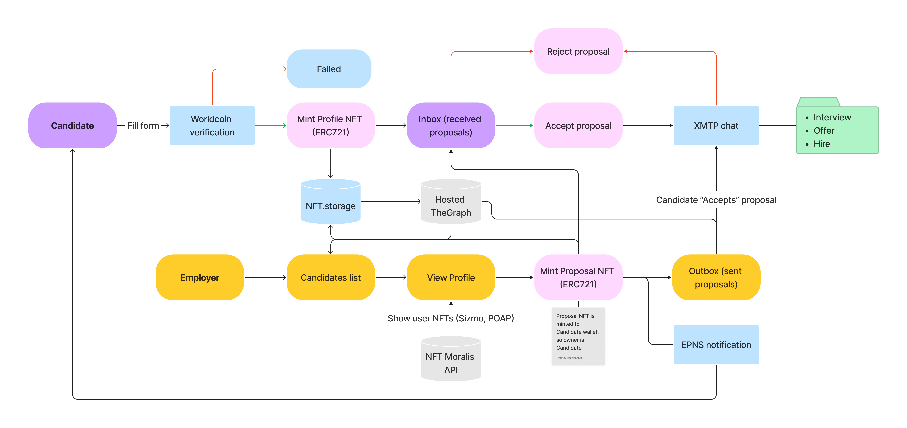

# Talents Ninja: ETHOnline 2022 Hackathon

> Decentralized talent pool for unbiased hiring

Tired of going through the same interviews? Be prejudiced before an
interview because of age, gender, skin color, or [name](https://www.raconteur.net/hr/diversity-inclusion/ethnic-name-bias/)?

Join our decentralized impersonal talent pool and start getting job
offers from top Web3 companies.

## How it works

- _Profiles_ are pseudo anonymous, only following data is stored:
  - Position
  - Category
  - Country (optional)
  - Work experience
  - English level
  - Employement type
  - Skills (optional)
  - Description (optional)
- _Proposal_ data is currently stored in plain test on IPFS, so don't put any private data in message. Encryption is yet to be implemented.
- All _Profile_ NFTs are Soulbound (non-transferable).
- All _Proposal_ NFTs are Souldbound (non-transferable).
- All Employers are marked 'Unverified' for Candidates, until Companies profiles will be implemented.



### Deployed contracts:

**Mumbai Polygon**

- Candidate NFT — [0xe1731923eC8465A078E04C65CF67806d2B222Da3](https://mumbai.polygonscan.com/address/0xe1731923eC8465A078E04C65CF67806d2B222Da3)
- Proposal NFT - [0x70F1d69cb1e9dE4F943403fe27E9297ff76B8f82](https://mumbai.polygonscan.com/address/0x70F1d69cb1e9dE4F943403fe27E9297ff76B8f82)

## Sponsors

**Eligible**

- Polygon: Smart contracts are deployed on Mumbai Polygon network (testnet) — for scalability and lower fees.
- Worldcoin: To create a Candidate NFT, you need to prove that you're real human and forces to have only one account.
- IPFS/Filecoin: NFT metadata is stored on IPFS network, pinned by NFT.storage.
- XMTP: Communication between candidate and employer
- EPNS: to send notification about new proposal

**Not sure:**

- TheGraph: Deployed as hosted graph with IPFS and full-text search features.
- Sizmo: Using existing badges for Candidate NFT. Loading all user NFTs from Moralis API (polygon and mainnet)
- QuickNode: for RPC on frontend site for Mainner Ethereum network

---

### Worldcoin ID

**Usage:**
In anonymous Talent Pool, each Candidate should be a real person. Thanks to Worldcoin, employers can be sure that he communicate with real person with only one profile.

**Depth of the integration:**
For hackathon I used onchain integration on staging environment.
Smart contract implementation: `/packages/hardhat/contracts/Candidate.sol`
Front-end implementation: `/packages/frontend/src/pages/MintProfile.jsx`

**Future posibilities:**

- Candidates and Employers at our platform could be a good fit for being Orb Operators — after building a track record of successfull hires and employements. And this will help to onboard new people to Talents.

**Issues:**

- Please, fix React widget — it changes fonts for the whole application.
- Sign out from mobile app.
- Improve availability of Worldcoin Simulator — I saw 502 more often than 200.

### NFT.Storage

**Usage:**
To store and pin Candidate, Proposal NFT's metadata on IPFS network.

**Issues**
UCAN is very raw and painfull to use.

### XMTP

**Usage:**
XMTP used as a main communication channel for Candidate and Employer.

**Issues**

- XMTP uses checksumed Ethereum addresses and considers lowercased as different one. It shouldn't be a case, as it's the same address.
- Too many signatures required

### EPNS

**Usage:**
Subgraph integration for EPNS — to individually notify Candidate on each Proposal creation.

**Issues**

- On dashboard it's not possible to change channel info or to use same Alias Address twice
- Incorrect number of subscribers on Admin Dashboard

### TheGraph

Unfortunately I can't deploy my subgraph to TheGraph Network, as it's using IPFS and full-text search features. And my protocol isn't useful without these features. Eventhough, subgraph for Talents propocol could be used to query Candidates by required parameters and use for statistics, HRs automation etc.

**Issues**

- ipfs.cat returns null from time to time (needs time to appear on network). And it breaks subgraph.
- `graph build` deletes startBlock attribute from .yaml cofig

## How to run with local node and TheGraph

```
yarn
yarn chain
yarn deploy
$CHAIN={your_chain_name} yarn create-config
yarn run-graph-node
yarn graph-create-local
yarn graph-ship-local
yarn start
```

Each time you stop local hardhat node, state will be lost => you'll need to:

- Reset Metamask wallet (to reset nonce)
- Clean graph-node (if data structure in smart contracts changed)

**Issue with --network localhost on hardhat**

Go to /etc/hosts and comment out this line

```
::1             localhost
```

---

#### How to setup UCAN for NFT-Storage

```
    <!-- If you don't have PK -->
    yarn ucan-keypair-new
    <!-- Reads UCAN_PK variable from .env -->
    yarn ucan-keypair-from

    <!-- Save DID and PUB_KEY to .env or elsewhere to use later -->

    <!-- Register your DID in NFT.Storage -->
    curl -X POST -H "Authorization: Bearer $NFT_STORAGE_KEY" -H 'Content-Type: application/json' --data "{\"did\": \"$DID\"}"
```

- Generate main DID token and save it
  - Generate new PK if no in .env
  - Request all data from PK
- Register API KEY
- Get ROOT token
